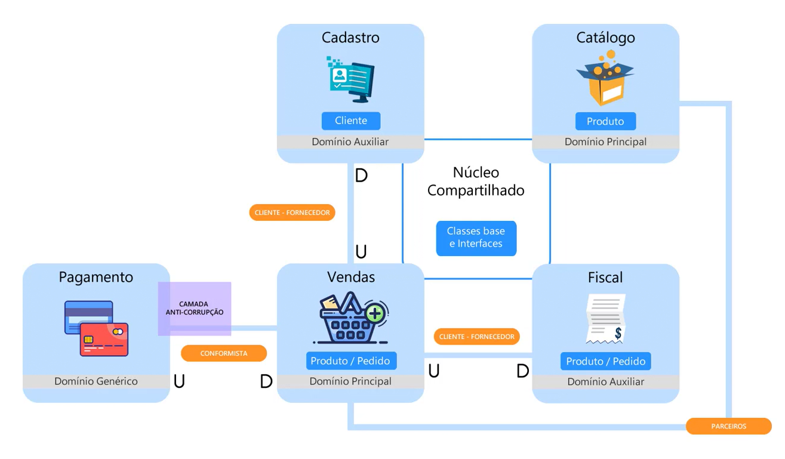

# NerdStore.API | .NET 6

Projeto de testes desenvolvido durante estudo do curso **[Modelagem de Domínios Ricos](https://desenvolvedor.io/curso-online-modelagem-de-dominios-ricos)** da plataforma **[Desenvolvedor.io](https://desenvolvedor.io)**

## Modelagem de Domínios Ricos

- DDD
- Linguagem Ubíqua
- Modelagem Estratégica
- Modelagem Tática
- CQRS
- Event Sourcing

## Contextos do Projeto

- Cadastros
- Catálogo
- Core
- Fiscal
- Pagamentos
- Vendas

## Mapa de Contextos

<h1 align="center"> 
	
</h1>